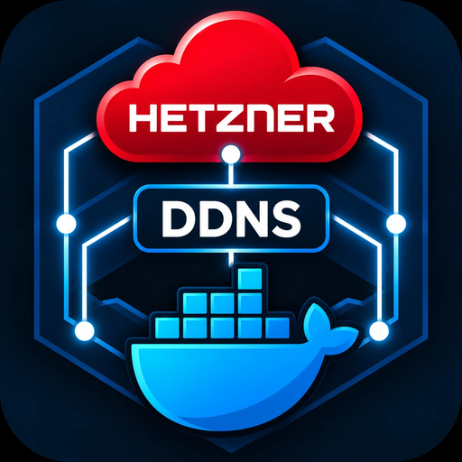

# Hetzner Dynamic DNS Update via Cloud API



[](https://opensource.org/licenses/MIT)

## About This Fork

This is a fork of [`mbaiti/hetzner-ddns`](https://github.com/mbaiti/hetzner-ddns). If you only need to
keep a single domain/subdomain up to date, the original project is simpler and works just as well -
use that instead. This fork exists for one reason: **managing multiple domains/subdomains from a
single container**, instead of running one container per domain.

Changes compared to the original:

*   **Multi-domain support:** Configuration was changed from a single `HETZNER_DNS_ZONE_NAME` /
    `HETZNER_DNS_RECORD_NAME` pair to numbered slots (`HETZNER_DNS_ZONE_NAME_1` /
    `HETZNER_DNS_RECORD_NAME_1`, `_2`, `_3`, ...). **This is a breaking change** - environment
    variables from the original project's `docker-compose.yaml` will not work with this fork's image
    without renaming them. See [Docker-Compose Example](#docker-compose-example) below.
*   **One shared API token, one shared IP check:** All domains use the same `HETZNER_CLOUD_API_TOKEN`.
    The public IP is fetched once per interval and applied to every configured domain, rather than
    once per domain.
*   **Fault isolation:** A misconfigured or temporarily unreachable domain is logged and skipped; it
    does not stop the other domains from being updated.
*   **Different image location:** This fork's image is published to
    [`ghcr.io/niphehke/hetzner-ddns`](https://github.com/niphehke/hetzner-ddns/pkgs/container/hetzner-ddns)
    (GitHub Container Registry) via GitHub Actions, not to Docker Hub. The original `mbaiti/hetzner-ddns`
    image on Docker Hub is unaffected by this fork and still contains only the single-domain version.

A slim Dynamic DNS Updater for Hetzner DNS entries, which uses the new Hetzner Cloud API. This tool monitors your public IP address and automatically updates one or more A-records in your Hetzner DNS zone(s) if the IP address changes. Ideal for home servers or other dynamic IP environments.

This project is an adapted version of the original `filiparag/hetzner_ddns`, but has been completely optimized for operation in a Docker container with environment variables.

## Features

*   **Uses the new Hetzner Cloud API:** Compatible with current Hetzner DNS management.
*   **Multi-domain:** Manage any number of zones/subdomains from a single container instance.
*   **Containerized:** Runs reliably and isolated in a Docker container.
*   **Configuration via Environment Variables:** Simple and secure configuration with `docker-compose`.
*   **Automatic IP Detection:** Regularly checks the public IPv4 address.
*   **Minimalist:** Slim Alpine Linux-based image and pure shell script for low resource consumption.
*   **Reliable:** Updates the DNS entry only when the IP changes.
*   **Fault-isolated:** A misconfigured or unreachable domain is skipped and logged; it does not stop the others from being updated.

## Background on API Transition

Hetzner has integrated the management of its DNS zones into the Hetzner Cloud API. The old dedicated Hetzner DNS Console API is no longer the recommended method. This script was developed to support this new API structure. This requires using an API token from the Hetzner Cloud Console and adapted API endpoints for DNS management.

## Prerequisites

*   Docker and Docker Compose installed
*   A Hetzner Cloud account
*   A DNS zone migrated to the Hetzner Cloud Console (if it was originally created in the DNS Console).

## Setup

### Generate API Token

1.  Log in to your [Hetzner Cloud Console](https://console.hetzner.cloud/).
2.  Navigate to "Security" -> "API Tokens".
3.  Create a new API Token. Give it a descriptive name (e.g., "hetzner-ddns").
4.  Ensure that the token has at least the permission to **read and write DNS records**.
5.  Copy the generated token. It will be needed for the `HETZNER_CLOUD_API_TOKEN` environment variable.

### Prepare DNS Zone and Record

1.  Ensure that the DNS zone you want to update is visible and manageable in the Hetzner Cloud Console. If not, you may need to migrate it manually.
2.  Create an A-record for the hostname you want to update (e.g., `myhome.example.com` or `@` for the domain itself), and provide a placeholder value (e.g., `127.0.0.1`). The script will overwrite this value later.

### Docker-Compose Example

This example manages three domains/subdomains from a single container. Add or remove numbered
`HETZNER_DNS_ZONE_NAME_n` / `HETZNER_DNS_RECORD_NAME_n` pairs as needed - the numbering does not
need to be contiguous, and up to `MAX_DOMAIN_SLOTS` (default 20, override via env var) is supported
without any code change.

```yaml
services:
  hetzner-ddns:
    image: ghcr.io/niphehke/hetzner-ddns:latest
    container_name: hetzner-ddns
    restart: unless-stopped
    environment:
      - HETZNER_CLOUD_API_TOKEN=your_hetzner_cloud_api_token
      - CHECK_INTERVAL_SECONDS=300
      - HETZNER_DNS_ZONE_NAME_1=your-domain.com #The name of your DNS zone (e.g., "example.com")
      - HETZNER_DNS_RECORD_NAME_1=subdomain_or_@ #e.g. "myhost" for myhost.your_domain.com or "@" for your_domain.com
      - HETZNER_DNS_ZONE_NAME_2=your-domain.com
      - HETZNER_DNS_RECORD_NAME_2=another-subdomain
      - HETZNER_DNS_ZONE_NAME_3=other-domain.com
      - HETZNER_DNS_RECORD_NAME_3=yet-another-subdomain
```

To add domain 11 later, just add `HETZNER_DNS_ZONE_NAME_11` and `HETZNER_DNS_RECORD_NAME_11` to
the `environment` list and restart the container (`docker compose up -d`). No image rebuild or
script change is required unless you exceed `MAX_DOMAIN_SLOTS` (20 by default).

**Note:** All domains share the one `HETZNER_CLOUD_API_TOKEN`. This is intended for managing
multiple zones/records within your own Hetzner Cloud project/account, not for isolating
independent tenants.

### Logging
The script outputs logs with timestamps and the status of operations.

* **INFO:** For normal operations and successful updates.
* **DEBUG:** More detailed information (e.g., when no IP change is detected). Not used in the current version, but could be extended if needed.
* **WARNING:** For non-critical issues (e.g., IP detection failed).
* **ERROR:** For critical errors (e.g., API errors, missing configuration).
